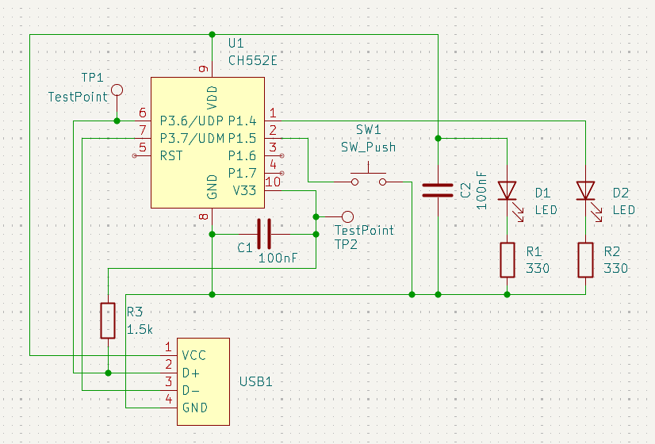
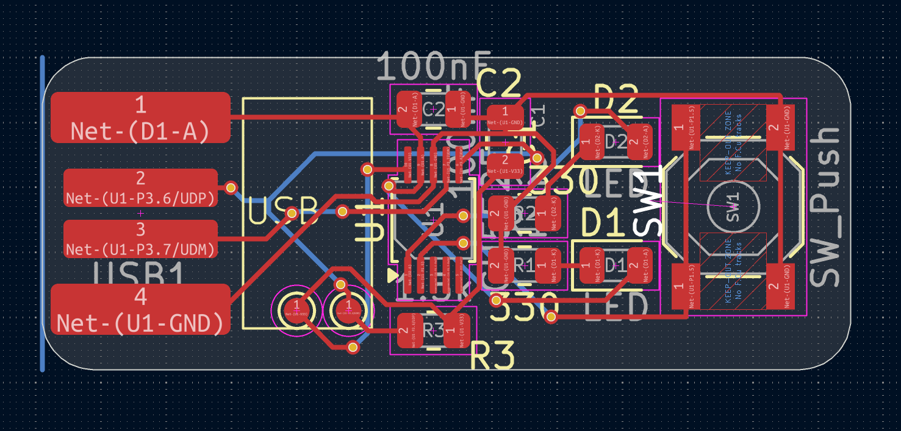
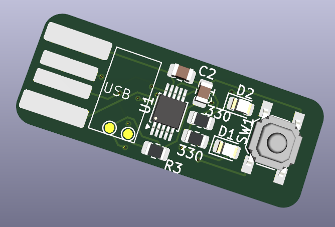

---
title: "Simple ch552e PCB"
author: "nilslmm"
description: "It can be used for many thinks. For blinking an LED or as an hid device"
created_at: "2026-09-11"
---

# September 11: Created the schematics
I started with the schematics. I know it's a mess, but it's my first own PCB.
I know I should work with Power Symbols....

Used a selfmade footprint and symbol for the USB-A connector which plugs directly into the USB-A port

**Total time spent: 2 hours**

# September 12: Created the board layout
I arranged the components as compact as possible and routed the pcb

**Total time spent: 3 hours**

