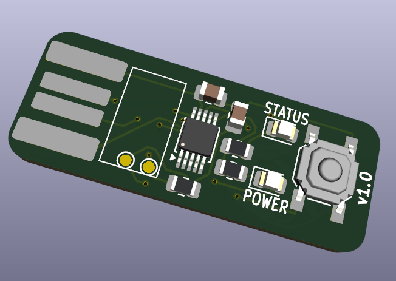
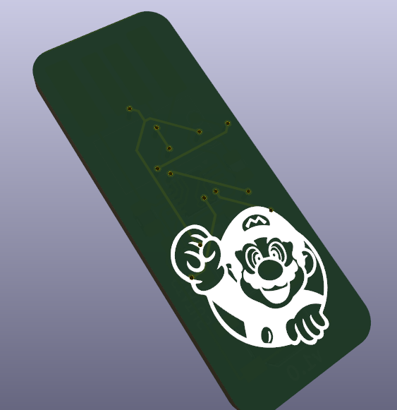

# ch552e
A simple PCB for the ch552e

I wanted to learn SMD soldering and PCB creation. That's why I came up with this small project.

The PCB comes with two LEDs. One Power indicator and one that can be programmed. One programmable button.
It has pads that can be bridged to enter bootloader mode.





# Usage
After getting the PCB manufactured and soldering all the components you can program it as you wish.

To program the ch552e using the Arduino IDE you need to add a Board Manager URL.
For this you go to File > Preferences and add ```https://raw.githubusercontent.com/DeqingSun/ch55xduino/ch55xduino/package_ch55xduino_mcs51_index.json```
After that you open the board manager and install 

# Example Code

```c
#include <USBHID.h>

const int statusLedPin = P1_4; 

void setup() {
  pinMode(statusLedPin, OUTPUT);
  USBInit();  
  
  // Delay for HID detection
  delay(2000);

  digitalWrite(statusLedPin, HIGH);
  Keyboard_print("supersecret");
  digitalWrite(statusLedPin, LOW);
}
void loop() {
}
```

Go to Tools and make sure you are using those settings:
Bootloader Pin: P3.6 (D+) pull-up
Clock Source: 16MHz (internal), 3.3v or 5v
Upload Method: USB
USB Settings: USER CODE w/ 148B USB (based on your use case you might want to use something else. For simple keystrokes this is the best. Do you own research for other use cases)


# BOM


| Amount | Component | Value | Size | Price | Package Size | Link |
|:---|:---:|:---:|:---:|:---:|---:|
| 2x | Capacitor | 100nF |  0805 | 0.39 EUR | 20 | https://www.lcsc.com/product-detail/C49678.html
| 1x | LED | Green |  0805 | 0.59 EUR | 100 | https://www.lcsc.com/product-detail/C19273151.html
| 1x | LED | Orange |  0805 | 0.82 EUR | 50 | https://www.lcsc.com/product-detail/C28310440.html
| 2x | Resistor | 330Ohm |  0805 | 0.54 EUR | 100 | https://www.lcsc.com/product-detail/C17630.html
| 1x | Resistor | 1.5kOhm |  0805 | 0.32 EUR | 100 | https://www.lcsc.com/product-detail/C2907216.html
| 1x | Tac Switch | SKQGABE010 | / | 1.24 EUR | 10 | https://www.lcsc.com/product-detail/C115351.html
| 1x | Chip | CH552E | / | 0.57 EUR | https://www.lcsc.com/product-detail/C967938.html
| 1x| PCB | / | / | 4.20 EUR | https://jlcpcb.com/

